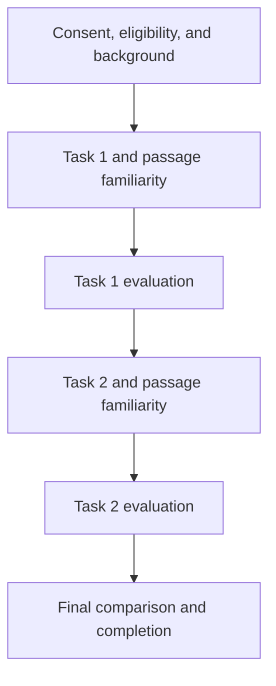

# Source-Grounded Bible-Study Assistant Experiment

This repository contains an **oTree research experiment** comparing two AI-assisted Bible-study systems:

1. **Baseline LLM:** answers questions using the displayed Bible passage and the language model's existing knowledge, without document retrieval.
2. **RAG-enhanced LLM:** retrieves relevant material from a curated biblical and theological corpus before generating an answer and presents the supporting sources.

Both conditions use the same language model, interface, core prompt, and generation settings. The intended experimental difference is whether retrieval context is supplied. Participants see the neutral labels **Bible Study Assistant A** and **Bible Study Assistant B** rather than the underlying system conditions.

## Research question

> How does a source-grounded Bible-study RAG system compare with the same LLM without retrieval in terms of technical grounding, expert-rated answer quality, and user experience?

The study examines whether retrieval grounding improves source support and answer quality, how users experience the two systems, and what limitations or risks remain when AI is used for Bible study.

## Project status

The current version is a **working local demo and pre-pilot research prototype**. It is not yet a production service and should not be used for participant recruitment until the study materials, system configuration, data handling, and ethics requirements have been finalized.

The assistants may produce inaccurate, incomplete, or overly confident responses. They are not substitutes for pastoral, theological, medical, legal, or other professional advice.

## Experimental design

The application uses a randomized, counterbalanced, within-participant crossover design:

- Eligible participants are Christian adults aged 18 or older who are comfortable using English for Bible study.
- Each participant completes two Bible-study tasks in one session.
- One task uses the baseline LLM and the other uses the RAG-enhanced LLM.
- System order and passage order are counterbalanced.
- Each task includes passage familiarity, an interactive chat, and an immediate evaluation.
- Participants must receive at least one successful chatbot response before continuing.
- An optional passage-specific suggested question is available if a participant cannot think of a question.
- After both tasks, participants compare the two systems and provide optional feedback.
- The application does not request names or contact details and creates no identity-to-response key.

The current implementation contains two passage blocks:

| Block | Passage 1 | Passage 2 |
| --- | --- | --- |
| A | 2 Kings 5:9–14 | Romans 14:1–6 |
| B | 1 Samuel 8:4–9 | 1 Corinthians 8:1–6 |

Together, passage order and system allocation produce eight sequence variants in the current code.



## Repository structure

| Path | Purpose |
| --- | --- |
| `intro/` | Study information, consent, eligibility confirmation, background questionnaire, random assignment, and participant instructions. |
| `bible_task/` | Two-round Bible-study task, passage familiarity question, live chat interface, response logging, and post-task evaluation. |
| `final_survey/` | Overall system preference, reasons for preference, optional feedback, and completion page. |
| `llm_rag/` | Shared configuration, prompts, Gemini API calls, retrieval logic, and baseline/RAG answer pipeline. |
| `scripts/` | Corpus preparation, validation, development-subset construction, indexing, retrieval tests, and pipeline tests. |
| `corpus/source_manifest.csv` | Source provenance and licensing information for the curated corpus. |
| `corpus/raw/` | Locally downloaded source material. This directory is excluded from Git. |
| `corpus/processed/` | Processed chunks, metadata, embeddings, and index configuration. This directory is excluded from Git. |
| `_templates/global/ProgressBar.html` | Shared study-progress component used across the oTree apps. |
| `_static/` | Shared CSS, JavaScript, and other static assets. |
| `settings.py` | oTree session configuration, app sequence, and participant-level fields. |
| `requirements.txt` | Python dependencies for the application. |
| `Procfile` | Process declaration for supported hosting environments. |
| `.env` | Local secrets and runtime configuration. This file must never be committed. |
| `.gitignore` | Excludes secrets, databases, participant data, local environments, corpus files, and generated artifacts. |

Empty `__init__.py` files are intentional: they mark directories as Python packages and should remain in the repository.

## How the two systems work

### Baseline condition

The baseline condition sends the displayed passage and participant question directly to the shared generation pipeline. No external chunks are retrieved, and no retrieval-source citations should be displayed.

### RAG condition

The RAG condition:

1. embeds the participant's question;
2. restricts retrieval to records relevant to the displayed passage;
3. ranks candidate chunks using normalized vector similarity;
4. supplies the highest-ranked chunks to the same generation model; and
5. displays source information associated with the retrieved evidence.

Retrieval records include source identifiers, titles, URLs, biblical references, similarity scores, and chunk identifiers for later evaluation.

## Local setup

### 1. Clone the repository

```bash
git clone https://github.com/jesstcchan/bible-study-rag-experiment.git
cd bible-study-rag-experiment
```

### 2. Create and activate a virtual environment

```bash
python3 -m venv .venv
source .venv/bin/activate
python -m pip install --upgrade pip
python -m pip install -r requirements.txt
```

### 3. Configure environment variables

Create a local `.env` file in the project root:

```dotenv
GEMINI_API_KEY=replace_with_your_own_key
OTREE_ADMIN_PASSWORD=replace_with_a_long_random_admin_password
OTREE_SECRET_KEY=replace_with_a_different_long_random_secret
OTREE_AUTH_LEVEL=STUDY
OTREE_PRODUCTION=1
```

The tracked `.env.example` file contains the same deployment placeholders.

Optional settings such as the chat model, embedding model, index directory, retrieval depth, temperature, output-token limit, timeout, and retry count are defined in `llm_rag/config.py` and may also be configured through environment variables.

Never commit `.env` or paste an API key into source code, screenshots, issues, or documentation.

### 4. Provide or rebuild the RAG index

The downloaded corpus and generated index are intentionally excluded from Git because they may be large and may contain third-party material subject to separate licence terms. A working RAG condition requires a completed local index containing:

```text
corpus/processed/development/index/
├── embeddings.npy
├── chunk_metadata.jsonl
└── index_config.json
```

The embedding model and dimension used at runtime must match the values stored in `index_config.json`. Use only source material that you are authorized to download, process, and redistribute.

### 5. Test the application

After the index is available, run:

```bash
python -m compileall intro bible_task final_survey llm_rag
python -m scripts.test_pipeline --condition both
```

The baseline test should report zero retrieved sources. The RAG test should return retrieved evidence for the selected passage.

### 6. Start oTree

```bash
otree devserver
```

Open the local address printed by oTree, normally `http://localhost:8000`, create a new demo session, and complete both task rounds.

## Data recorded by the application

The application creates a random `response_code` solely to connect one
person's study sections during analysis. The code is not shown to the person,
and no file or table may connect it to a name, email address, recruitment list,
or participant label. It is an analysis key, not an identity code.

The application records the assigned sequence, passage, system condition,
questionnaire responses, and response latency. Each attempted chat turn can
include:

- participant question and system answer;
- task round, passage, and internal system condition;
- response latency;
- success or error status;
- sanitized error type; and
- retrieved-source metadata for RAG responses.

Baseline turns should store an empty retrieved-source list. Common direct
identifiers in free text, such as email addresses, phone numbers, web
addresses, and social-media handles, are rejected before the text is stored or
sent to the model provider. This automated check cannot detect every name or
indirect identifier, so the instructions prohibit identifying information and
the final text must still undergo a local disclosure-risk review.

Use only these four custom exports for study analysis:

- `custom_export_anonymous_background`
- `custom_export_anonymous_chat_turns`
- `custom_export_anonymous_task_evaluations`
- `custom_export_anonymous_final_comparison`

They cover background data, task evaluations, chat/retrieval records, and the
final comparison. They exclude incomplete participants and do not contain
oTree's built-in participant code, participant label, or exact request times.
Join them only on `response_code`. Do not use oTree's standard data or page-time
exports as the research dataset, because those contain technical identifiers
and timing metadata.

## Anonymous-study deployment requirements

Code alone cannot make a hosted study anonymous. Before recruitment:

- use the room-wide URL for the `anonymous_bible_study` room;
- do not use a participant-label file or add `participant_label` to any URL;
- do not connect response codes to recruitment, attendance, contact, payment,
  or sign-up records;
- configure the hosting provider and reverse proxy not to retain participant IP
  addresses or user-agent logs, or arrange prompt deletion under an approved
  retention rule;
- do not retain or share oTree's technical page-time export, built-in
  participant codes, participant labels, or raw server access logs;
- exclude and delete incomplete records before analysis;
- remove accidental identifying details locally before expert review or
  publication; and
- document the residual re-identification assessment and have the supervisor,
  data-protection contact, or ethics committee confirm that the final design
  may be described as anonymous.

There is no oTree setting named `ANONYMOUS = True`; adding it does not provide
these protections.

## Files that must not be committed

Before every push, confirm that the following remain excluded:

- `.env` and API credentials;
- `.venv/` or other local environments;
- `db.sqlite3` and database backups;
- participant-level data and exports;
- raw corpus files;
- processed chunks and generated embedding indexes; and
- logs or temporary files containing prompts or responses.

Useful checks:

```bash
git check-ignore -v .env .venv db.sqlite3 corpus/raw corpus/processed
git status --short
```

## Pre-pilot checklist

Before collecting research data:

- replace all placeholder researcher names, affiliations, and contact details;
- confirm the final Bible passages and translation;
- ensure the written protocol matches the eight implemented sequence variants;
- use an unlabelled room-wide recruitment link and verify that exported
  participant-label fields are empty;
- test the free-text identifier checks and the completed-study export filter;
- freeze the model, prompt, temperature, output limit, retrieval depth, corpus, and index;
- test every sequence from consent through completion;
- verify that baseline answers never display retrieved citations;
- verify that every RAG citation corresponds to an actually retrieved source;
- inspect the oTree export and custom chat-turn export;
- complete theological expert review and rubric piloting; and
- obtain the required supervisor and ethics determination before recruitment.

## Reproducibility

For each frozen study version, record:

- Git commit and release tag;
- oTree and Python dependency versions;
- chat and embedding model identifiers;
- complete system prompt;
- generation temperature and maximum output tokens;
- retrieval depth and passage-filtering rules;
- corpus and index SHA-256 checksums; and
- the date on which the configuration was frozen.

## Third-party content and licence notice

The repository's source manifest documents the provenance of corpus materials. Third-party Bible translations, notes, lexical resources, and theological commentary remain subject to their respective licences and terms of use. Inclusion of source-processing code does not grant permission to redistribute the underlying content.

No general project licence is asserted unless a separate `LICENSE` file is added.
